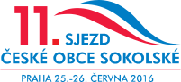

_Aktualizováno 2016-05-10_

Již skoro tři roky pracuji v [Ústřední škole České obce sokolské](http://www.sokol.eu/obsah/232/ustredni-skola-cos).

## Na čem v současnosti pracuji

### Připravované akce

* náhradní zkoušky školení Instruktor parkouru
* školení II. třídy _Instruktor parkouru_ (a.k.a. Instruktor volnočasových sportovních aktivit se zaměřením na parkour)
* školení _Cvičitel zdravotní tělesné výchovy III. třídy_
* školení _Trenér skoků na trampolíně III. třídy_
* seminář _Street Workout_
* seminář _Noha a její ploska_
* seminář _Polohová relaxace_

### Chystané publikace

* kniha _Rok ve cvičebních jednotkách RDPD_
* metodické listy na téma _funkční trénink_
* kniha _Parkour a freerunnink ve městě i v tělocvičně_

### Další projekty

* vylepšení [systému elektronického vzdělávání](http://ucebna.sokol.eu)
* podílení se na přípravě 11. sjezdu České obce sokolské

---

Popis mé pracovní pozice je následující:

> **Metodická činnost**
> 
> Po odborné stránce připravuje program pro oblast:
> 
> * zdravotní tělesná výchova
> * parkour
> * hudební pohybové formy
> * jóga
> * fitness
> * další sporty na základě jednání s OS
> 
> Zodpovídá:
> 
> * za složení lektorského sboru v pověřených oblastech
> * za dodržování učebního plánu a osnov 
> * za sestavení obsahu a struktury vzdělávací akce na základě stanovených vzdělávacích cílů
> * za zadání pokynu externím lektorum 
> * za řádné vedení příslušné pedagogické dokumentace vzdělávací akce a přípravu podkladů pro evidenci 
> * za rozpracování obsahu vzdělávací akce do minutového programu 
> * za zpracování vyhodnocení vzdělávací akce
> 
> Spolupracuje:
> 
> * při zpracování vlastních učebních nebo podpůrných textů pro vzdělávací akce ve svěřených oblastech 
> * s příslušnými komisemi a sbory odboru všestrannosti a odboru sportu a dále dle pokynů ředitele ÚŠ ČOS 
> * na zajištění podkladů pro tvorbu pracovních dohod a fakturaci pro externí lektory
> 
> Dále:
> 
> * sleduje novinky v příslušných oborech a zařazuje je do programu 
> * připravuje metodické články do časopisu a metodické materiály
> 
> **Lektorská činnost**
> 
> * příprava na teoretickou a praktickou výuku na akcích ÚŠ ČOS 
> * prezentace učiva s přizpůsobením účastníkům kurzu 
> * motivování účastníků vzdělávacích akcí ÚS ČOS
> 
> **Organizační činnost**
> 
> * organizační zajištění přidělených akcí včetně zpracování dokumentace
> * pravidelné hlášení výsledků své činnosti ve svěřených úkolech 
> * identifikování možnosti ke kontinuálnímu zlepšování činnosti a chodu ÚŠ ČOS
> * doplňování odborné literatury, vedení evidence knih 
> * spolupráce s časopisem Sokol
> * příprava podkladů pro akreditační řízení vzdělávacích programů 
> * správa profilu na sociálních sítích
> * zajišťování informací o akcích ÚŠ ČOS na webových stránkách 
> * správa technického zabezpečení evidence a přihlášek účastníků vzdělávacích akcí
> * tisk osvědčení
> 
> **Dále plní úkoly dle pokynů ředitele ÚŠ ČOS**

Převážná část mojí pracovní náplně tvoří příprava a organizace vzdělávacích akcí pro cvičitele, kteří cvičí v sokolských jednotách. Za uplynulé tři roky proběhlo pod mým vedením 24 vzdělávacích akcí různého rozsahu a na dalších několika jsem spolupracoval.

## Vzdělávací akce, které jsem organizoval

Instruktor parkouru – 150hodinové školení, kromě organizačního zajištění a výuky jsem vytvořil kurikulum a připravil podklady pro akreditování školení MŠMT (18 účastníků)

Cvičitel zdravotní tělesné výchovy II. třídy – 150hodinové školení (21 účastnic)

Cvičitel jógy III. třídy (2 školení, celkem 29 účastníků)

Elixír mládí (2 semináře, celkem 54 účastníků)

Parkour Workshop (2 semináře, celkem 53 účastníků)

Napětí a dotyk (4 semináře, celkem 50 účastníků)

Noha a její ploska (2 semináře, celkem 40 účastníků)

Aktivní po padesátce (38 účastníků)

Aerobik a hudební formy s náčiním (38 účastníků)

Zdravotníci zotavovacích akcí (školení a seminář, celkem 29 účastníků)

seminář Jóga pro zdravá záda (26 účastníků)

Rope Skipping (25 účastníků)

Atletika v sokolské všestrannosti (22 účastníků)

Kruhový trénink pro muže (20 účastníků)

Hooping (17 účastníků)

Zranění ve cvičebních jednotkách sportovní všestrannosti (11 účastníků)

## Další akce a projekty, na kterých jsem se podílel

* webové stránky Ústřední školy a stránky akcí na sokol.cz
* e-learning - výběr a testování výukového prostředí
* správa sociálních médií (facebook)
* on-line formulář pro přihlašování na akce Ústřední školy (a navazující systém zpracování těchto údajů)

* semináře Parkour a Rope skipping pro Vzdělávací středisko Olomouc (výuka)
* doprovodný program (parkour, testy zdatnosti a netradiční hry) pro akci Sokolské Brno (výuka, organizace)

* školení v Bulharsku pro Bulgaria BeActive a WOW sport fitness (výuka v angličtině)
* Výročí 90 let otevření Tyršova domu (organizace, technické zajištění)
* Mezinárodní seminář cvičení rodičů a dětí PaCH 2014 (organizace, technické zajištění)
* Prázdninová škola mladých pomahatelů (výuka, organizace)
* Seminář parkouru a rope skippingu pro pedagogy na Tělo Olomouc (výuka)
* Projekt Move Week 2014 (organizační zajištění)

Absolvoval jsem kurzy:

* Nutriční poradenství v praxi (FTVS UK)
* Seminář o práci s dobrovolníky na VŠTVS Palestra
* Google Apps

## Další činnosti, kterým jsem se věnoval

Tvorba metodických materiálů, včetně tvorby nebo zprostředkování grafiky, úprava licenční smlouvy pro publikaci pod licencí Creative Commons.

* [Metodické listy o parkouru](http://www.sokol.cz/data/files/GREY_brezen_1_2014-1396951904.pdf)
* [Metodické listy o rope skippingu](http://www.sokol.eu/metodicke-materialy/rope-skipping.pdf)
* článek [Vizuální zpětná vazba při nácviku sportovní techniky](http://www.sokol.eu/metodicke-materialy/vizualni-zpetna-vazba.pdf)

Správa CRM databází našich zákazníků (účastníků akcí) a subdodavatelů (lektorů, pronajímatelů prostor) včetně mailingového listu v MailChimpu

Spolupráce na návrhu technického řešení zvažovaného kreditového systému vzdělávání cvičitelů ČEské obce sokolské

Spolupráce s odborem všestrannosti ČOS na projektu standardizace vybavení (příprava a zpracování dat on-line formuláře)

Marketingový průzkum zájmu o vzdělávací akce

Analýza a dokumentace pracovních procesů v rámci ústřední školy

Zavedení nástrojů pro lepší komunikaci a management projektů v rámci týmu ([Slack](https://slack.com/), [Trello](https://trello.com/))

Typografická úprava knihy Rok ve cvičebních jednotkách rodičů a dětí a předškolních dětí

Připomínkování a úprava osnov pro vzdělávání cvičitelů III. třídy

Překlady z a do angličtiny a korektury dokumentů

Analýza dat s pomocí Google Fusion Tables pro [výroční zprávu Ústřední školy](http://www2.sokol.eu/priloha/1571/2014-vyrocni-zprava-us-cos.pdf)

Zajištění nákupu technického vybavení a literatury pro Ústřední školu

Příprava emailových newsletterů vč. správy přihlašovacích formulářů a importu dat v MailChimpu

Fotografování na pořádaných vzdělávacích akcích

Technická podpora pro aplikace Google v rámci týmu Ústřední školy a školení zaměstnanců Odboru všestrannosti ČOS

Testování redakčního systému webových stránek novy.sokol.eu pro předsednictvo ČOS